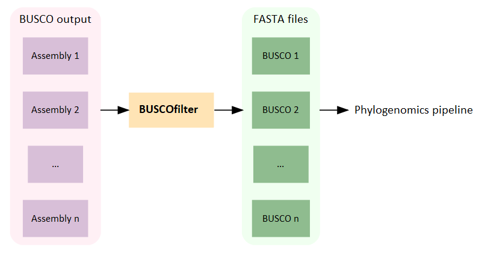

# BUSCOfilter

A tool to filter [**BUSCO**](https://busco.ezlab.org/) output into folders of common single copy sequences to be aligned for phylogenomics.



## Requirements

BUSCOfilter is a bash script which runs in the Linux command line. To download, simply use:

```
git clone https://github.com/Rowena-h/BUSCOfilter.git
```

Make the script executable with:

```
chmod +x BUSCOfilter
```

## Usage

Option | Description
------ | -----------
-h, --help | Display these options
-d, --directory | Directory containing busco output folders which must have the typical 'run_' prefix


### Example

```
./BUSCOfilter -d /data/busco_folders
```

## Output

In addition to a folder containing fasta files for each selected single copy BUSCO, the following files are produced when running BUSCOfilter:

File | Description
------ | -----------
assembly_list | A list of the assemblies found in the provided directory (i.e. the name of each BUSCO output folder after the 'run_' prefix)
busco_stats | A tabular summary of the BUSCO run statistics for all the provided assemblies
busco_list | A list of IDs for the single copy BUSCOs that are found in all assemblies
error_list | If there is a problem in producing any of the fasta files, the BUSCO IDs are stored in this file so that fasta files can be manually checked
